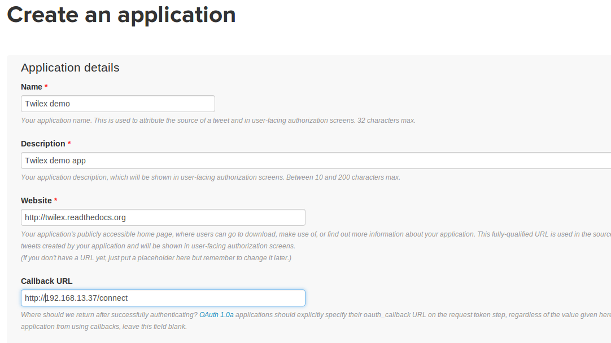
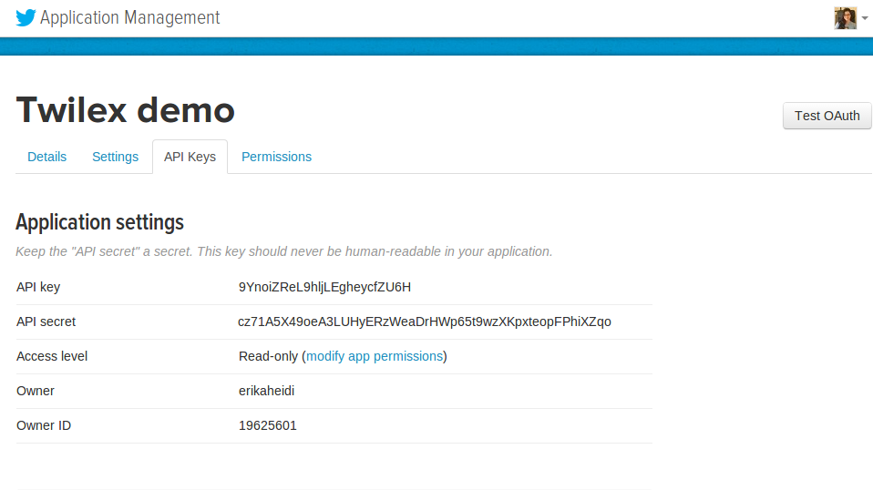

Twitter APP Creation
====================

In order to use TTools and have access to the Twitter API, you need to create an application on the `Twitter Developers page <http://dev.twitter.com>`_.
If this is the first time you do this, here you can find a step-by-step guide.

Sign-up / Sig-in
----------------
Go to http://dev.twitter.com and sign in.

Access your applications
------------------------
Access the item "My Applications" from the menu.

Create the application
----------------------

Now click on "Create New App". You'll fill a form like this:

Name
^^^^
The application name that will be used in the authorization screen.

Description
^^^^^^^^^^^
A comprehensive description that will be used in the authorization screen.

Website
^^^^^^^
A website were people can find more information about the application.

Callback URL
^^^^^^^^^^^^
This is **important** when you want to create an application that authenticates users.

The callback URL is a URL to where the user will be redirected right after authorizing the application.
You can use the code provided in the `basic multi-user application example <basic_multiuser.html>`_ for this endpoint.

Now get your Keys
-----------------
You'll need the **API key** (consumer_key) and **API secret** (consumer_secret) in order to configure TTools.
These keys are available at the tab "API Keys" in your application settings:

Note about app permissions
--------------------------

The default permission for new apps is **read only**. With this permission you won't be able to create tweets or change
any data. If you think you will need write permission, you can edit your application settings to make the change.